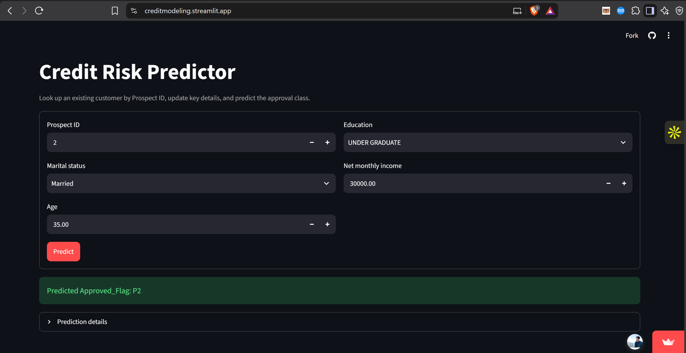
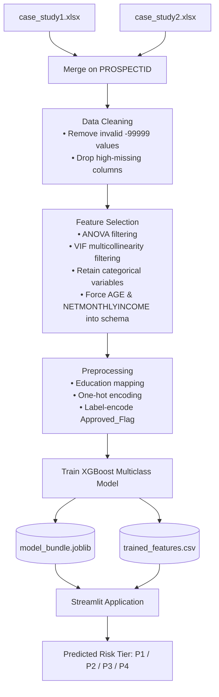
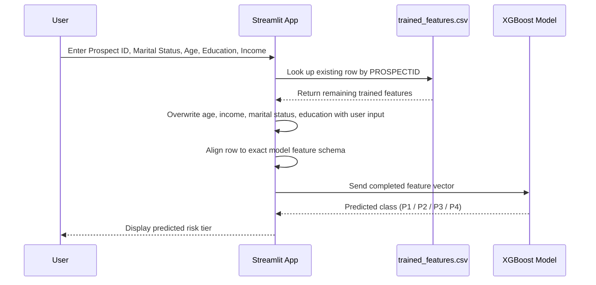

# 💳 Credit Risk Modeling — Multiclass Applicant Classification (P1–P4)

**An end-to-end credit-risk classification system that scores loan applicants into priority tiers (P1–P4) using XGBoost, and serves live predictions through an interactive Streamlit application.**

🔗 **Live App:** [creditmodeling.streamlit.app](https://creditmodeling.streamlit.app/)

---

## 📌 Table of Contents

- [Business Objective](#-business-objective)
- [Project Highlights](#-project-highlights)
- [Tech Stack](#-tech-stack)
- [Data Pipeline](#-data-pipeline)
- [Feature Engineering & Selection](#-feature-engineering--selection)
- [Model Details](#-model-details)
- [Application Functionality](#-application-functionality)
- [Repository Structure](#-repository-structure)
- [How to Run Locally](#-how-to-run-locally)
- [Business Impact](#-business-impact)
- [Future Improvements](#-future-improvements)
- [Author](#-author)

---

## 🎯 Business Objective

Financial institutions manually review large volumes of loan applications to gauge credit risk — a process that is slow, inconsistent, and expensive to scale. This project builds a **multiclass credit-risk classification system** that automatically assigns every applicant to one of four risk tiers:

| Tier | Meaning |
|------|---------|
| **P1** | Lowest risk — highest priority for approval |
| **P2** | Low-to-moderate risk |
| **P3** | Moderate-to-high risk |
| **P4** | Highest risk — requires closer scrutiny |

**Why it matters to the business:**

- ✅ **Automates initial credit-risk assessment**, removing manual bottlenecks
- ✅ **Reduces manual review effort** so analysts can focus on edge cases
- ✅ **Delivers consistent, data-driven decisions** across every applicant, using historical customer behavior instead of subjective judgment
- ✅ **Speeds up the credit decision cycle**, improving both operational efficiency and applicant experience

---

## 🌟 Project Highlights

- Built a full **data-to-deployment pipeline**: raw data → cleaning → feature selection → model training → production-ready app
- Applied rigorous statistical feature selection (**ANOVA** + **VIF**) rather than relying on default model importance alone
- Trained a **multiclass XGBoost classifier** to predict 4 risk categories from real-world-style credit bureau and demographic data
- Designed a **hybrid Streamlit interface** that blends live user input with backend historical records — mimicking how a real credit-decision tool would work with partial live data and a customer database
- Packaged the trained model, encoders, and feature schema into a single deployable artifact (`model_bundle.joblib`) for reproducible inference

---

## 🖥️ Web Application Preview

<p align="center">
  
</p>

*Interactive Streamlit application for credit risk assessment and lender prioritization.*

---


## 🛠 Tech Stack

| Category | Tools |
|---|---|
| **Language** | Python |
| **Modeling** | XGBoost (multiclass classification) |
| **Data Processing** | Pandas, NumPy |
| **Feature Selection** | ANOVA (statistical filtering), VIF (multicollinearity filtering) |
| **Encoding** | One-Hot Encoding, Label Encoding |
| **App Framework** | Streamlit |
| **Model Packaging** | joblib |
| **Exploration** | Jupyter Notebook (`eda.ipynb`) |
| **Deployment** | Streamlit Community Cloud |

---

## 🔄 Data Pipeline



**Pipeline stages explained:**

1. **Ingestion & Merge** — Two raw source files are combined on the shared `PROSPECTID` key to build a unified applicant record.
2. **Data Cleaning** — Sentinel/invalid values (`-99999`) are stripped out, and columns with excessive missingness are dropped to protect model quality.
3. **Feature Selection** — Statistical rigor is applied instead of relying purely on the model:
   - **ANOVA** tests numeric feature relevance against the target class.
   - **VIF (Variance Inflation Factor)** removes multicollinear features to keep the model stable and interpretable.
   - Key business-relevant fields (`AGE`, `NETMONTHLYINCOME`) are explicitly retained even if statistically borderline, since they are core to real-world underwriting.
4. **Preprocessing** — Categorical fields like education are mapped to ordinal/numeric scales, remaining categoricals are one-hot encoded, and the target `Approved_Flag` is label-encoded for multiclass training.
5. **Model Training** — An XGBoost classifier is trained on the fully processed feature set.
6. **Artifact Export** — The trained model, label encoder, and exact feature schema are bundled into `model_bundle.joblib`; a parallel `trained_features.csv` stores each customer's trained feature values for backend lookup at inference time.

---

## 🧪 Feature Engineering & Selection

The model considers a wide range of applicant and behavioral signals, including:

- 💰 Income level (high/low income bands)
- 🎂 Applicant age
- ⚠️ Number and recency of delinquencies
- 💳 Recent payment behavior
- 🔍 Credit enquiries (frequency, recency)
- 📊 Loan exposure across products
- 📈 Credit utilization ratio
- 🏦 Existing financial products held
- 💼 Employment duration

Feature selection combined **statistical filtering (ANOVA, VIF)** with **domain judgment** — ensuring the final feature set is both statistically sound and business-relevant.

---

## 🤖 Model Details

**Algorithm:** XGBoost (Extreme Gradient Boosting) — Multiclass Classification

**How it works:**
- XGBoost builds an ensemble of decision trees **sequentially**.
- Each new tree is trained specifically to correct the residual errors of the trees before it (gradient boosting).
- The combined output of all trees is aggregated into a single **multiclass prediction** across the four risk tiers: `P1`, `P2`, `P3`, `P4`.

**Why XGBoost for this problem:**
- Handles mixed numeric/categorical, non-linear relationships common in credit bureau data
- Robust to outliers and missing-value patterns typical of financial datasets
- Strong out-of-the-box performance on structured/tabular data
- Provides feature importance for model explainability — important in credit risk contexts

**Deployment artifact:** `model_bundle.joblib` bundles the trained model, the fitted label encoder (for decoding `P1`–`P4`), and the exact training-time feature schema — ensuring inference-time consistency.

---

## 💻 Application Functionality

The Streamlit app (`app.py`) demonstrates a realistic hybrid workflow: **light user input + rich backend history.**

**User-facing inputs (5 fields):**
1. Prospect ID
2. Marital status
3. Age
4. Education
5. Net monthly income

**Behind the scenes:**



1. The app looks up the applicant's existing record in `trained_features.csv` using **Prospect ID**.
2. It pulls all other trained features (delinquencies, utilization, enquiries, etc.) from that historical record.
3. The four user-editable fields — **age, income, marital status, education** — are overwritten with the values the user enters live, simulating an updated applicant profile.
4. The resulting row is **aligned to the exact schema** the model was trained on (correct column order, encoding, and data types).
5. The completed feature vector is passed to the **XGBoost model** bundled in `model_bundle.joblib`.
6. The predicted risk tier (**P1, P2, P3, or P4**) is displayed to the user instantly.

This design keeps the app lightweight (no need to re-enter dozens of credit bureau fields) while still letting a user test "what-if" scenarios on the four most business-relevant inputs.

---

## 📁 Repository Structure

```
Credit-Risk-Modeling/
│
├── app.py                      # Streamlit application (user-facing prediction tool)
├── build_model_artifacts.py    # Full training pipeline: cleaning → feature selection → training → export
├── eda.ipynb                   # Exploratory data analysis notebook
├── model_bundle.joblib         # Trained XGBoost model + label encoder + feature schema
├── trained_features.csv        # Backend lookup table (PROSPECTID + trained features)
├── requirements.txt            # Python dependencies
└── .gitignore
```

---

## 🚀 How to Run Locally

**1. Clone the repository**
```bash
git clone https://github.com/Soumya03-commits/Credit-Risk-Modeling.git
cd Credit-Risk-Modeling
```

**2. Install dependencies**
```bash
pip install -r requirements.txt
```

**3. Build model artifacts** (trains the model and generates the backend lookup file)
```bash
python build_model_artifacts.py
```
This produces:
- `model_bundle.joblib` — trained XGBoost model, label encoder, and feature schema
- `trained_features.csv` — backend lookup data with `PROSPECTID` and trained features

**4. Launch the app**
```bash
streamlit run app.py
```

Or simply try the hosted version: 👉 **[creditmodeling.streamlit.app](https://creditmodeling.streamlit.app/)**

---

## 📊 Business Impact

| Before | After |
|---|---|
| Manual, judgment-based credit review | Automated, data-driven risk scoring |
| Inconsistent decisions across reviewers | Consistent classification using a single trained model |
| Slow turnaround on applications | Near-instant P1–P4 prediction |
| High analyst workload on every case | Analyst effort redirected to borderline/high-risk cases |

---

## 🔮 Future Improvements

- Add SHAP-based explainability so each prediction shows *why* an applicant was classified into a given tier
- Expose model confidence/probability scores alongside the predicted class
- Add model monitoring for feature drift over time
- Containerize the app (Docker) for more portable deployment
- Add automated tests for the data pipeline and inference logic

---

## 👤 Author

**Soumya**
📂 [GitHub Profile](https://github.com/Soumya03-commits)

If you found this project interesting, feel free to ⭐ star the repo or connect!
